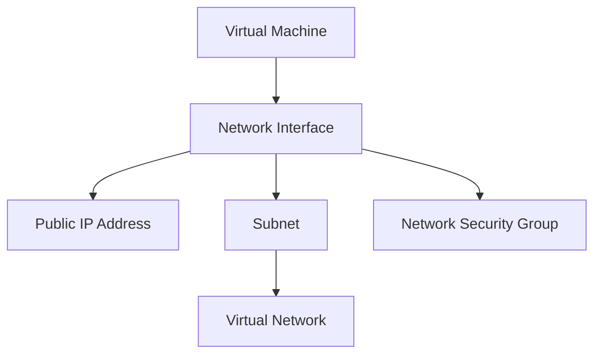

+++
title = "3. Provision a Virtual Machine on Azure using an ARM template"
weight = 3
date = 2024-02-21
draft = false
+++

## Introduction

This tutorial is designed to give a basic understanding of cloud concepts to those who are interested in learning how to set up a virtual machine (VM) on Azure using an ARM template. We will go through the process step-by-step deploying an Ubuntu 22.04 LTS VM, creating a minimalistic solution that can be used as a foundation for further development.

## Method

- We will use an ARM template to define and provision the Azure resources required for our VM, including network configurations and security settings.
- The ARM template will be launched using the Azure CLI, having a _code-first_ approach to cloud infrastructure.
- Access to the deployed VM will be via password (in order to adhere to the minimalistic approach).

## Prerequisites

- An Azure account. If you don't have one, sign up [here](https://azure.microsoft.com/).
- Basic familiarity with JSON and the Azure Command-Line Interface (CLI).
- For Windows users: GitBash or similar terminal (Mac and Linux users can use the pre-installed terminal)

## Provision a Virtual Machine Using ARM Template

**Prepare Your ARM Template**

Create a JSON file named `vm_arm_template.json` and paste in the following ARM template code

> vm_arm_template.json

  ```bash
  {
  "$schema": "https://schema.management.azure.com/schemas/2019-04-01/deploymentTemplate.json#",
  "contentVersion": "1.0.0.0",
  "parameters": {},
  "variables": {},
  "functions": [],
  "resources": [],
  "outputs": {}
  }
  ```

With this structure, you have a minimal, empty but valid ARM template. We will fill in the resource section as needed during this tutorial.

This template includes:

- **parameters** {}: inputs that users can pass to the template from the _outside_.
- **variables** {}: values that are reused within the template.
- **functions** []: user-defined functions for use within the template.
- **resources** []: the Azure resources to be provisioned or updated.
- **outputs** {}: values that are returned after deployment.


**Provision the ARM Template Using Azure CLI**

Open your CLI tool and navigate to the directory containing your ARM template and log in to your Azure account using `az login` (if you haven't already).

Run these commands:

```bash
az group create --name ArmDemoRG --location northeurope
az deployment group create --resource-group ArmDemoRG --template-file vm_arm_template.json
```

At this stage you should have a resource group but no other resources provisioned on Azure (since the template doesn't define any resources). 

On Azure resources are asociated with a resource group.

Verify the success of the deployment in the Azure portal:

1. **Navigate to Resource Groups:** In the Azure portal, locate and click on the "Resource Groups" section.
2. **Select the Resource Group:** Choose the resource group where you deployed the ARM template.
3. **Deployments Section:** Within the resource group, choose the section labeled "Deployments" in the menu.
4. **View Deployed Templates:** Here, you'll see a list of deployments made within that resource group. ARM template deployments will have a "Microsoft.Template" type.  Click on the deployment to view its details, including the template itself.

**Provision the Resources iteratively step-by-step**

An ARM template is _idempotent_, which means you can run it several times and expect the same outcome. Changes in the template will be reflected in what is provisioned. This gives us an opportunity to develop the resources we want in an iterative way.

For each change you want to provision you simply run the `az deployment group create` command again.

If something goes wrong during the process and you want to start all over, the easiest way is to delete the resource group and start fresh with a new resource group.

You can run the folowing command to delete the resource group: (just in case you want to start fresh)

```bash
az group delete --resource-group ArmDemoRG
```

**Start the developing process**

Before we begin we need to analyze the minimal configuration of a VM.

Mandatory Properties of a VM

- name: Provides a unique name for your virtual machine.
- type: Identifies the resource type as a virtual machine ("Microsoft.Compute/virtualMachines").
- apiVersion: Specifies the version of the Resource Manager API used for the VM resource.
- location: Specifies the Azure region where the VM will be deployed.
- properties: Contains the following nested mandatory properties:
  - hardwareProfile:
    - vmSize: The size of the VM (e.g., "Standard_B1s").
  - osProfile:
    - computerName: The hostname for the VM.
    - adminUsername: The administrative username for the VM.
    - adminPassword: The administrative password (or the reference to a secret stored elsewhere like in Azure Key Vault).
  - storageProfile:
    - imageReference: Details the OS image to use for the VM.
    - osDisk: Configuration for the VM's operating system disk.
  - networkProfile:
    - networkInterfaces: An array of network interface references. Each reference typically contains an id property pointing to the resource ID of a network interface (Microsoft.Network/networkInterfaces).


Most resources depend on other resources to work correctly. Virtual machines must be associated with a virtual network and to do that it needs a network interface. The dependsOn element is used to make sure that the network interface is ready to be used before the VMs are created:

```json
"dependsOn": [
  "[concat('Microsoft.Network/networkInterfaces/', 'myNIC', copyindex())]"
],
```

Resource Manager deploys in parallel any resources that aren't dependent on another resource being deployed.

In order to develop the ARM template we need to understand the dependencies a VM has on other resources. Let's break it down and visualize it in a graph.



The easies way is to build the template is from _ground up_ i.e. beginning with the resources without any dependencies. The approach we will take is to add resources in the following order and verify them in the Azure portal between each iteration.

1. Virtual network / subnet (these are usually configured together in an ARM template)
2. Public IP
3. Network Security Group - NSG (opening port 22 for SSH)
4. Network Interface Card - NIC
5. Virtual Machine (Ubuntu 22.04)

**Step 1: Virtual network / subnet**


This ARM template section defines a virtual network with the following properties:

- Location: Inherited from the resource group
- Address space: 10.0.0.0/16 (Note the CIDR notation for 65534 IP addresses)
- Subnet: DemoVM-VirtualNetwork-Subnet with address prefix 10.0.0.0/24 (254 IP addresses)

Add the following code in your template:

```json
{
"$schema": "https://schema.management.azure.com/schemas/2019-04-01/deploymentTemplate.json#",
"contentVersion": "1.0.0.0",
"parameters": {},
"variables": {},
"functions": [],
"resources": [
    // Virtual Network and Subnet
    {
        "name": "DemoVirtualNetwork",
        "type": "Microsoft.Network/virtualNetworks",
        "apiVersion": "2023-04-01",
        "location": "[resourceGroup().location]",
        "properties": {
            "addressSpace": {
                "addressPrefixes": [
                    "10.0.0.0/16"
                ]
            },
            "subnets": [
                {
                    "name": "DemoSubnet",
                    "properties": {
                        "addressPrefix": "10.0.0.0/24"
                    }
                }
            ]
        }
    }
],
"outputs": {}
}
```

Verify, in the Azure portal, that the resource has been correctly provisioned.

**Step 2: Public IP**

This ARM template section defines a public IP with the following properties:

- Location: Inherited from the resource group
- Properties - publicIPAllocationMethod: Dynamic (This means the public IP address can change when the associated resource is stopped or deallocated)

Add the following code section to your template:

> Note the comma after the first section. The `resourses:` is a list where each resource definition is separated by a comma (,)

```json
"resources": [
    // Virtual Network and Subnet
    {
    ...
    },
    // Public IP
    {
        "name": "DemoPublicIP",
        "type": "Microsoft.Network/publicIPAddresses",
        "apiVersion": "2023-04-01",
        "location": "[resourceGroup().location]",
        "properties": {
            "publicIPAllocationMethod": "Dynamic"
        }
    }
],
```

Verify, in the Azure portal, that the resource has been correctly provisioned.

**Step 3: Network Security Group - NSG**

This ARM template section defines a Network Security Group (NSG) with the following properties:

- Location: Inherited from the resource group
- Security Rules - SSH: This rule allows inbound traffic on port 22 (SSH) from any source address (*). The priority of 100 ensures it takes precedence over potentially more restrictive rules.

Add the following code section to your template:

```json
"resources": [
    // Virtual Network and Subnet
    {
    ...
    },
    // Public IP
    {
    ...
    },
    // Network Security Group
    {
        "name": "DemoNSG",
        "type": "Microsoft.Network/networkSecurityGroups",
        "apiVersion": "2023-04-01",
        "location": "[resourceGroup().location]",
        "properties": {
            "securityRules": [
                {
                    "name": "SSH",
                    "properties": {
                        "access": "Allow",
                        "direction": "Inbound",
                        "priority": 100,
                        "protocol": "Tcp",
                        "sourcePortRange": "*",
                        "sourceAddressPrefix": "*",
                        "destinationPortRange": "22",
                        "destinationAddressPrefix": "*"
                    }
                }
            ]
        }
    }
],
```

Verify, in the Azure portal, that the resource has been correctly provisioned.


**Step 4: Network Interface Card - NIC**

This ARM template section defines a Network Interface Card (NIC) with the following properties:

- Location: Inherited from the resource group
- privateIPAllocationMethod: Dynamic (assigned automatically within the subnet)
- publicIPAddress: Associates the DemoPublicIP with this NIC
- subnet: Places the NIC within the 'DemoSubnet' of the 'DemoVirtualNetwork'.
- networkSecurityGroup: Associates the DemoNSG with this NIC, applying the NSG's security rules.

**Dependencies: This resource depends on the creation of the following:**
- DemoPublicIP (Public IP address)
- DemoVirtualNetwork (Virtual network)
- DemoNSG (Network Security Group)

> Note the dependencies! This is the resource that ties the previous resources together. Since we will refer to these other resources, we must not forget to add the `"dependsOn":` attribute in order to make sure the resources are created in the proper order.

Add the following code section to your template:

```json
"resources": [
    // Virtual Network and Subnet
    {
    ...
    },
    // Public IP
    {
    ...
    },
    // Network Security Group
    {
    ...
    },
    // Network Interface Card
    {
        "name": "DemoNIC",
        "type": "Microsoft.Network/networkInterfaces",
        "apiVersion": "2023-04-01",
        "location": "[resourceGroup().location]",
        "dependsOn": [
            "[resourceId('Microsoft.Network/publicIPAddresses', 'DemoPublicIP')]",
            "[resourceId('Microsoft.Network/virtualNetworks', 'DemoVirtualNetwork')]",
            "[resourceId('Microsoft.Network/networkSecurityGroups', 'DemoNSG')]"
        ],
        "properties": {
            "ipConfigurations": [
                {
                    "name": "DemoIPConfig",
                    "properties": {
                        "privateIPAllocationMethod": "Dynamic",
                        "publicIPAddress": {
                            "id": "[resourceId('Microsoft.Network/publicIPAddresses', 'DemoPublicIP')]"
                        },
                        "subnet": {
                            "id": "[resourceId('Microsoft.Network/virtualNetworks/subnets', 'DemoVirtualNetwork', 'DemoSubnet')]"
                        }
                    }
                }
            ],
            "networkSecurityGroup": {
                "id": "[resourceId('Microsoft.Network/networkSecurityGroups', 'DemoNSG')]"
            }
        }
    }
],
```

Verify, in the Azure portal, that the resource has been correctly provisioned.

**Step 4: Virtual Machine**

Finally we have come to the Virtual Machine resource. This ARM template section defines a VM with the following properties:

- Location: Inherited from the resource group
- vmSize: Standard_B1s (This defines the hardware capabilities of the VM)
- adminUsername: azureuser
- adminPassword: S3cur3P@ssw0rd (Important: Avoid storing passwords directly in templates; use secure mechanisms like SSH keys or Azure Key Vault references instead)
- imageReference: Specifies an Ubuntu 22.04 'Jammy Jellyfish' image (latest available)
- createOption: FromImage (Indicates that the disk is created from the specified OS image)
- networkInterfaces: Associates the 'DemoNIC' network interface with this VM.


**Dependencies: This resource depends on the creation of the following:**
- DemoNIC (Network interface)

Add the following code section to your template:

```json
"resources": [
    // Virtual Network and Subnet
    {
    ...
    },
    // Public IP
    {
    ...
    },
    // Network Security Group
    {
    ...
    },
    // Network Interface Card
    {
    ...
    },
    // Virtual Machine
    {
        "name": "DemoVM",
        "type": "Microsoft.Compute/virtualMachines",
        "apiVersion": "2023-03-01",
        "location": "[resourceGroup().location]",
        "dependsOn": [
            "[resourceId('Microsoft.Network/networkInterfaces', 'DemoNIC')]"
        ],
        "properties": {
            "hardwareProfile": {
                "vmSize": "Standard_B1s"
            },
            "osProfile": {
                "computerName": "DemoVM",
                "adminUsername": "azureuser",
                "adminPassword": "S3cur3P@ssw0rd"
            },
            "storageProfile": {
                "imageReference": {
                    "publisher": "Canonical",
                    "offer": "0001-com-ubuntu-server-jammy",
                    "sku": "22_04-lts-gen2",
                    "version": "latest"
                },
                "osDisk": {
                    "name": "DemoVM-OSDisk",
                    "createOption": "FromImage"
                }
            },
            "networkProfile": {
                "networkInterfaces": [
                    {
                        "id": "[resourceId('Microsoft.Network/networkInterfaces', 'DemoNIC')]"
                    }
                ]
            }
        }
    }
],
```

Verify, in the Azure portal, that the resource has been correctly provisioned.

## Accessing the VM

- Once the deployment is complete, find your VM's public IP address in the Azure Portal or via CLI:
  ```bash
  az vm show --resource-group ArmDemoRG --name DemoVM --show-details --query publicIps --output tsv
  ```
- Use SSH to connect to your VM:
  ```bash
  ssh azureuser@<your-vm-public-ip>
  ```

## Verify Your Setup

- Confirm that the VM is running Ubuntu 22.04 LTS by checking the release information:
  ```sh
  lsb_release -a
  ```

## Troubleshooting

- **Deployment Errors**: Check the Azure CLI output for any error messages. Common issues include misconfigurations in the ARM template or insufficient permissions.
- **SSH Connectivity**: Ensure the NSG rules allow inbound SSH traffic (port 22). If connection issues persist, verify the public IP address and your local network settings.

## Final Thoughts

This tutorial demonstrates a _code-first_ approach to provisioning VMs in Azure, enhancing reproducibility and efficiency. ARM templates offer a powerful way to manage Azure resources _declaratively_, allowing for easy versioning, sharing, and modification.

Consider exploring additional VM configurations and Azure services to further enhance your cloud infrastructure.

Here are some next step improvements to consider:

1. **Parameterize Inputs**: Convert fixed values, such as VM size, names, and network configurations, into parameters. This allows for more flexible deployments without modifying the template directly. For instance, the admin username, password, VM size, and the network settings can be parameterized to adjust for different environments or requirements.

2. **Secure Credentials**: Instead of hardcoding the admin password, use SSH keys or Azure Key Vault to store and reference secrets securely. This approach enhances security by avoiding plaintext passwords in your templates.

3. **Automate VM Configuration**: Add the use of `cloud-init` to automate the configuration of the VM post-provisioning. This could include software installations, system updates, and application setups that are not covered in the template.

4. **Outputs for Key Information**: Utilize the outputs section to return important information post-provisioning, such as the public IP address of the VM, to easily access the provisioned resources.


## Don't Forget

Always clean up resources you no longer need to manage costs effectively.

Now you can delete the resource group using this command:

```bash
az group delete --resource-group ArmDemoRG
```

# Happy Deploying on Azure! 🚀


### References:

Virtual machines in an Azure Resource Manager template: https://learn.microsoft.com/en-us/azure/virtual-machines/windows/template-description

Microsoft.Compute virtualMachines: https://learn.microsoft.com/en-us/azure/templates/microsoft.compute/virtualmachines?pivots=deployment-language-arm-template#virtualmachineproperties-1

Understand the structure and syntax of ARM templates: https://learn.microsoft.com/en-us/azure/azure-resource-manager/templates/syntax

Find and use Azure Marketplace VM images: https://learn.microsoft.com/en-us/azure/virtual-machines/windows/cli-ps-findimage


# TL;DR

Here are all the Azure CLI commands used in this tutorial:

```bash
# Create a resource group
az group create --name ArmDemoRG --location northeurope

# Provision resources with the ARM template
az deployment group create --resource-group ArmDemoRG --template-file vm_arm_template.json

# Get the public IP of the VM
az vm show --resource-group ArmDemoRG --name DemoVM --show-details --query publicIps --output tsv

# Delete the resource group
az group delete --resource-group ArmDemoRG --yes --no-wait
```

Use SSH to connect to the VM:

```bash
ssh azureuser@<your-vm-public-ip>

# Example:
ssh azureuser@52.169.182.206
azureuser@52.169.182.206's password: S3cur3P@ssw0rd
```

Here is the complete ARM template:

> vm_arm_template.json

```json
{
"$schema": "https://schema.management.azure.com/schemas/2019-04-01/deploymentTemplate.json#",
"contentVersion": "1.0.0.0",
"parameters": {},
"variables": {},
"functions": [],
"resources": [
    // Virtual Network and Subnet
    {
        "name": "DemoVirtualNetwork",
        "type": "Microsoft.Network/virtualNetworks",
        "apiVersion": "2023-04-01",
        "location": "[resourceGroup().location]",
        "properties": {
            "addressSpace": {
                "addressPrefixes": [
                    "10.0.0.0/16"
                ]
            },
            "subnets": [
                {
                    "name": "DemoSubnet",
                    "properties": {
                        "addressPrefix": "10.0.0.0/24"
                    }
                }
            ]
        }
    },
    // Public IP
    {
        "name": "DemoPublicIP",
        "type": "Microsoft.Network/publicIPAddresses",
        "apiVersion": "2023-04-01",
        "location": "[resourceGroup().location]",
        "properties": {
            "publicIPAllocationMethod": "Dynamic"
        }
    },
    // Network Security Group
    {
        "name": "DemoNSG",
        "type": "Microsoft.Network/networkSecurityGroups",
        "apiVersion": "2023-04-01",
        "location": "[resourceGroup().location]",
        "properties": {
            "securityRules": [
                {
                    "name": "SSH",
                    "properties": {
                        "access": "Allow",
                        "direction": "Inbound",
                        "priority": 100,
                        "protocol": "Tcp",
                        "sourcePortRange": "*",
                        "sourceAddressPrefix": "*",
                        "destinationPortRange": "22",
                        "destinationAddressPrefix": "*"
                    }
                }
            ]
        }
    },
    // Network Interface Card
    {
        "name": "DemoNIC",
        "type": "Microsoft.Network/networkInterfaces",
        "apiVersion": "2023-04-01",
        "location": "[resourceGroup().location]",
        "dependsOn": [
            "[resourceId('Microsoft.Network/publicIPAddresses', 'DemoPublicIP')]",
            "[resourceId('Microsoft.Network/virtualNetworks', 'DemoVirtualNetwork')]",
            "[resourceId('Microsoft.Network/networkSecurityGroups', 'DemoNSG')]"
        ],
        "properties": {
            "ipConfigurations": [
                {
                    "name": "DemoIPConfig",
                    "properties": {
                        "privateIPAllocationMethod": "Dynamic",
                        "publicIPAddress": {
                            "id": "[resourceId('Microsoft.Network/publicIPAddresses', 'DemoPublicIP')]"
                        },
                        "subnet": {
                            "id": "[resourceId('Microsoft.Network/virtualNetworks/subnets', 'DemoVirtualNetwork', 'DemoSubnet')]"
                        }
                    }
                }
            ],
            "networkSecurityGroup": {
                "id": "[resourceId('Microsoft.Network/networkSecurityGroups', 'DemoNSG')]"
            }
        }
    },
    // Virtual Machine
    {
        "name": "DemoVM",
        "type": "Microsoft.Compute/virtualMachines",
        "apiVersion": "2023-03-01",
        "location": "[resourceGroup().location]",
        "dependsOn": [
            "[resourceId('Microsoft.Network/networkInterfaces', 'DemoNIC')]"
        ],
        "properties": {
            "hardwareProfile": {
                "vmSize": "Standard_B1s"
            },
            "osProfile": {
                "computerName": "DemoVM",
                "adminUsername": "azureuser",
                "adminPassword": "S3cur3P@ssw0rd"
            },
            "storageProfile": {
                "imageReference": {
                    "publisher": "Canonical",
                    "offer": "0001-com-ubuntu-server-jammy",
                    "sku": "22_04-lts-gen2",
                    "version": "latest"
                },
                "osDisk": {
                    "name": "DemoVM-OSDisk",
                    "createOption": "FromImage"
                }
            },
            "networkProfile": {
                "networkInterfaces": [
                    {
                        "id": "[resourceId('Microsoft.Network/networkInterfaces', 'DemoNIC')]"
                    }
                ]
            }
        }
    }
],
"outputs": {}
}
```


